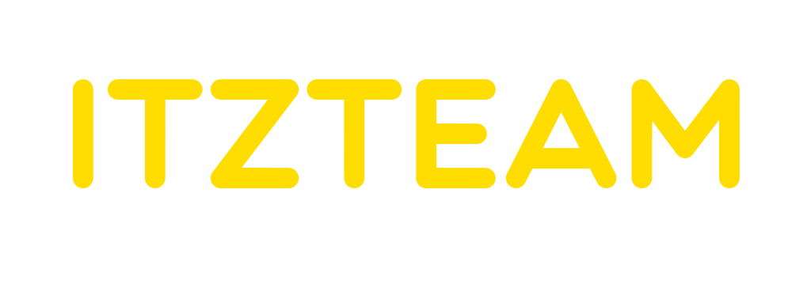

   

<h2>I wrote this site for my ItzTeam and also used it as a thesis html & css</h2>

All link:

<a style="font-size: 20px" href="https://getbootstrap.com/">Bootstrap</a>
 
<a style="font-size: 20px" href="https://itztest.netlify.app">ItzTeam</a>
 
<a style="font-size: 20px" href="https://getbootstrap.com/">Figma</a>

<h1 align="center">Other link</h1>

[Bstore](https://t.me/thebelkin)
|
[telegram](https://t.me/kenyka)
|
[YouTube](https://www.youtube.com/channel/UCM6InRH22Xno8nywrZnbhLA)
|
[GGdash](https://discord.gg/r6gCRR75Un)